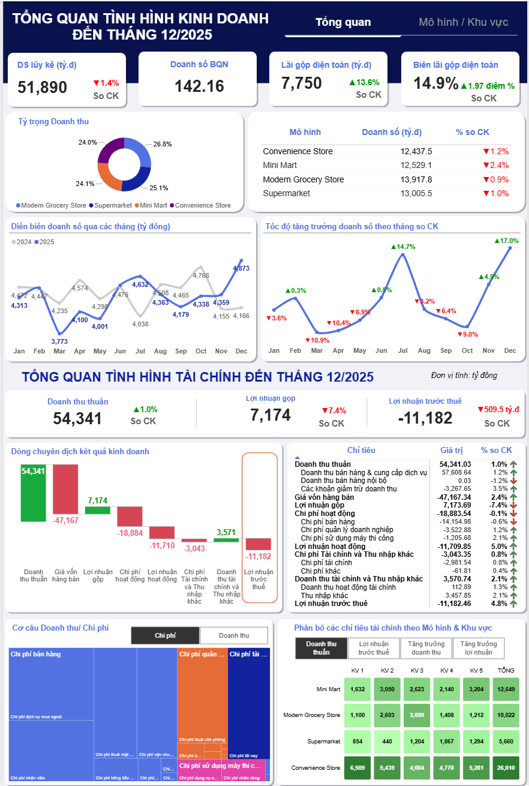
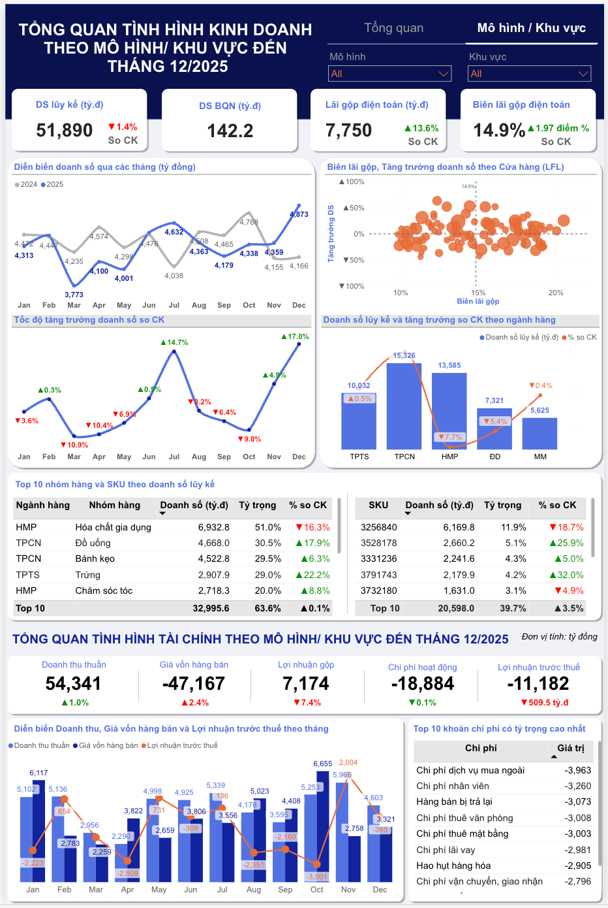
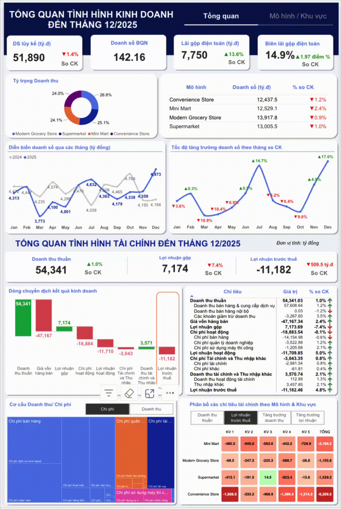

# Sales & Finance Performance | Retail

Dashboard cung cấp góc nhìn tổng quan về hiệu quả kinh doanh và tài chính, phân tích doanh thu, chi phí và lợi nhuận theo mô hình bán lẻ, khu vực và đơn vị kinh doanh, qua đó hỗ trợ nhận diện xu hướng, phát hiện biến động và ra quyết định điều hành dựa trên dữ liệu.

---

## 📊 Dashboard Preview

* **Direct Download:** [Download sales-performance-powerbi.pbix](./sales-performance-powerbi.pbix)
* **Status:** Public Portfolio Project

## Các trang báo cáo

- **Trang 1 - Tổng quan tình hình kinh doanh & tài chính**: Theo dõi các chỉ tiêu chính về tình hình kinh doanh và hiệu quả tài chính. 



- **Trang 2 - Phân tích chi tiết theo Mô hình & Khu vực**: Xem chi tiết kết quả hoạt động từ khu vực/đơn vị đến ngành hàng, nhóm hàng và SKU; đồng thời theo dõi doanh thu, chi phí và hiệu quả tài chính theo thời gian.



### Demo GIF



## 🎯 Mục tiêu

- Tổng hợp dữ liệu tài chính và bán hàng trên một mô hình dữ liệu thống nhất.
- Theo dõi các chỉ tiêu doanh thu, chi phí, giá vốn và các giá trị tài chính.
- Phân tích biến động theo năm/tháng, khu vực, cửa hàng, ngành hàng và nhóm hàng.
- Hỗ trợ drill-through từ báo cáo tổng quan đến trang phân tích chi tiết.


## 🛠️ Công nghệ

| Công cụ / kỹ thuật | Mô tả |
|---|---|
| **Power BI Desktop** | Dùng để phát triển báo cáo với định dạng project `.pbip`. |
| **Semantic model (TMDL)** | Quản lý bảng, cột, measure, relationship và cấu trúc mô hình dữ liệu theo dạng TMDL. |
| **Power BI Modeling MCP Server** | Kết nối AI Agent với PBIP, hỗ trợ kiểm tra và cập nhật mô hình dữ liệu trong quá trình phát triển. |
| **Power Query** | Nạp, làm sạch và biến đổi dữ liệu trước khi mô hình hóa. |
| **Parquet, Excel** | Là nguồn dữ liệu mẫu trong quá trình demo và phát triển. |
| **Deneb** | Dùng cho một số trực quan hóa tùy chỉnh trong báo cáo. |

## 📂 Cấu trúc project

```text
.
├── README.md
├── .gitignore
├── sales-performance-powerbi.pbip
├── sales-performance-powerbi.pbix
├── assets/
│   └── demo-dashboard.gif
├── data/
│   ├── fact-finance_dummy.parquet
│   ├── fact-salesbysku_dummy.parquet
│   ├── sku.xlsx
│   └── store.xlsx
├── sales-performance-powerbi.Report/
│   ├── definition/
│   │   ├── report.json
│   │   ├── version.json
│   │   ├── bookmarks/
│   │   └── pages/
│   ├── CustomVisuals/
│   └── StaticResources/
├── sales-performance-powerbi.SemanticModel/
│   ├── definition.pbism
│   ├── diagramLayout.json
│   └── definition/
│       ├── database.tmdl
│       ├── model.tmdl
│       ├── relationships.tmdl
│       ├── cultures/
│       ├── tables/
│       └── ...
└── .git/
```

## 📦 Mô hình dữ liệu

| Bảng | Mô tả |
|---|---|
| `fact_finance` | Dữ liệu tài chính theo ngày, tài khoản, tiểu khoản, cửa hàng, khu vực và năm; chứa các trường như `Concept`, `Tài khoản`, `Tiểu khoản`, `Date`, `Trị giá`, `StoreID`, `Area`, `StoreName`, `Year`. |
| `fact_sales_month` | Dữ liệu bán hàng theo tháng, SKU và cửa hàng; chứa `StoreId`, `MonthKey`, `Sku`, `Quantity`, `Cost`, `SalesNoVat`, `Concept`, `Year`. |
| `dim_store` | Thông tin cửa hàng như `Store ID`, `Store Name`, `Area`, `Address`, `Latitude`, `Longitude`, `Store Status`. |
| `dim_sku` | Thông tin SKU, ngành hàng, nhóm hàng và mã ngành hàng. |
| `Calendar`, `DimMonth` | Các chiều thời gian phục vụ phân tích theo ngày, tháng và năm. |
| `DimAccount`, `DimSubAccount`, `DimPL` | Hệ thống tài khoản và phân loại báo cáo kết quả kinh doanh. |
| `DimArea`, `DimConcept` | Các chiều khu vực và mô hình/khái niệm kinh doanh. |
| `Measure`, `_measures` | Các measure và chỉ tiêu KPI dùng trong báo cáo. |
| `Heatmap` | Bảng hỗ trợ trực quan hóa heatmap trong báo cáo. |

## 📑 Dữ liệu mẫu

Dữ liệu mẫu hiện đang nằm trong thư mục `data/` và được các partition trong semantic model đọc trực tiếp từ các file local hiện tại:

- `fact-finance_dummy.parquet`: dữ liệu tài chính mẫu.
- `fact-salesbysku_dummy.parquet`: dữ liệu bán hàng theo SKU và tháng mẫu.
- `store.xlsx`: dữ liệu tham chiếu cửa hàng.
- `sku.xlsx`: dữ liệu tham chiếu SKU, ngành hàng và nhóm hàng.

Lưu ý: các `File.Contents(...)` trong TMDL đang dùng đường dẫn local của máy hiện tại (ví dụ `C:\Users\xxx\Documents\...` hoặc `C:\Users\xxx\Documents\sales-performance-powerbi\data\...`), nên khi chuyển project sang môi trường/máy khác cần cập nhật lại đường dẫn tương ứng hoặc thay bằng nguồn dữ liệu phù hợp.

## 🚀 Cách sử dụng

1. Cài đặt **Power BI Desktop** phiên bản hỗ trợ Power BI Project.
2. Mở file `sales-performance-powerbi.pbip`.
3. Kiểm tra và cập nhật đường dẫn đến các file Parquet nếu cần.
4. Chọn **Refresh** để nạp dữ liệu mới.
5. Sử dụng bộ lọc trên từng trang và drill-through để xem chi tiết.

> ***Ghi chú:** Project sử dụng dữ liệu mẫu (Dummy Data) trong Data cho mục đích phát triển và minh họa; dữ liệu không phản ánh số liệu thực tế.*
